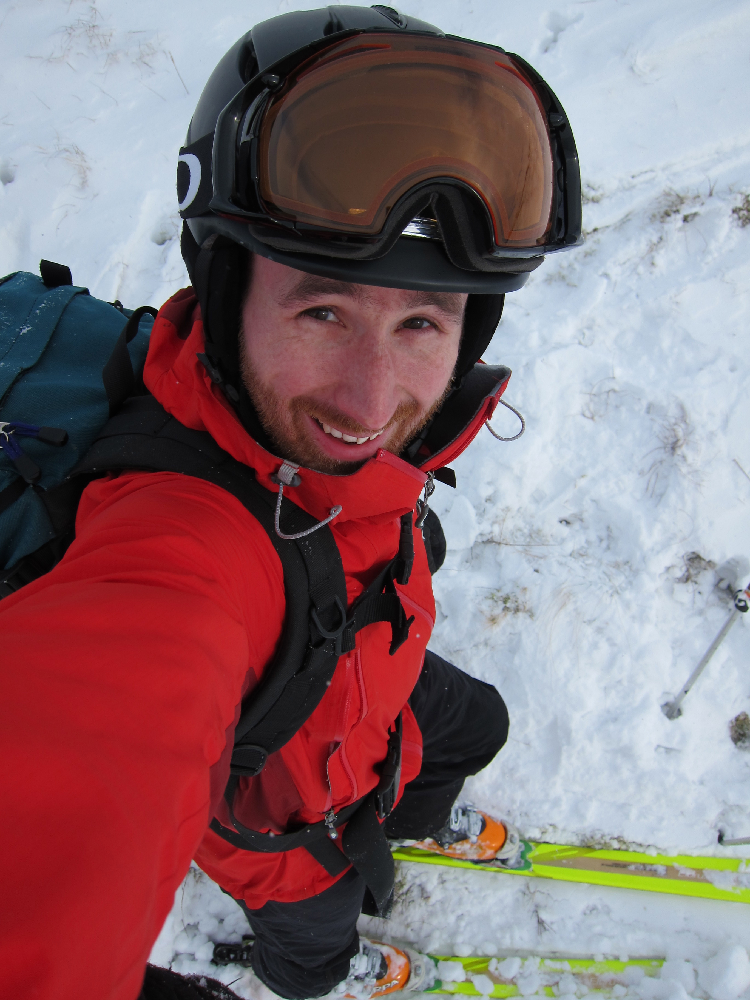
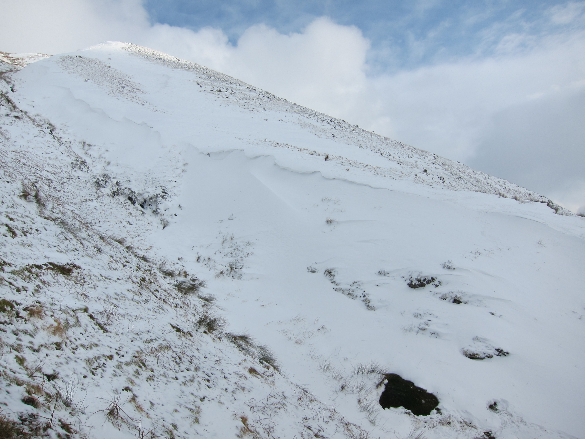

Well we were nothing if not victorious! Granted, by alpine or even Scottish standards our trip was short, but you can't beat getting out and skiing without the flights and faff. Yes, we drove for 3 hours (cheers Luke!) between getting there, realising "there" was actually somewhere else and finding it, and getting back home. And yes, we only really skied for an hour and a half including skinning up to the top. Was it worth it?

Hopefully the shot of me just before we dropped in sums up my opinion on the matter.

I woke up on Saturday morning full of hope and enthusiasm, but the strong winds that came with the snow on Friday had scoured every open slope, dumping the light powder behind sheltered walls or straight into the sea. My plans quickly changed to walking, and a quick trip up Carnedd Llywellyn made me glad we hadn't lugged the skis up there! It turns out Llanberis had a better time of it, and there were some good runs to be had.

On a tip-off we headed down past Dolwyddelan early Sunday morning and found a few potential lines where snow had been dumped in gullies and left a corridor down the side of the hill.

After much debate, realising that the hills in the distance always looked snowier than they were up-close and turning around, we ended up at the base of a straightforward shallow gully just on the descent towards Dinas Mawddwy. The picture makes it pretty obvious - these were not "awesome pow pow" conditions, but when you live in North Wales you've got to seize any opportunity you can, and the snow band was actually in surprisingly good nick.

There are a few more photos [on my Flickr set](http://www.flickr.com/photos/spikeheap/sets/72157632570675874/).

