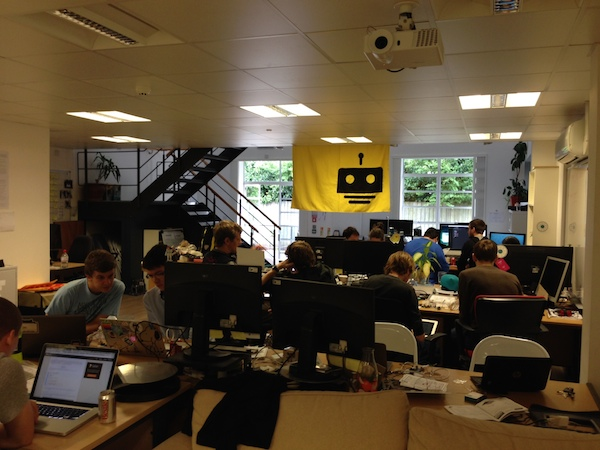
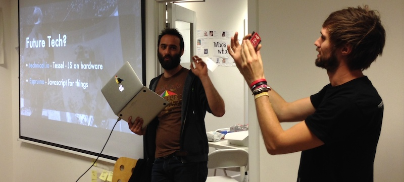
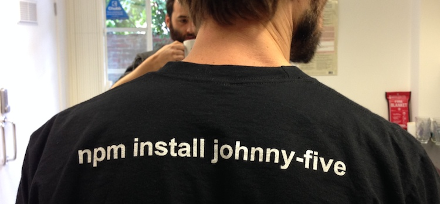
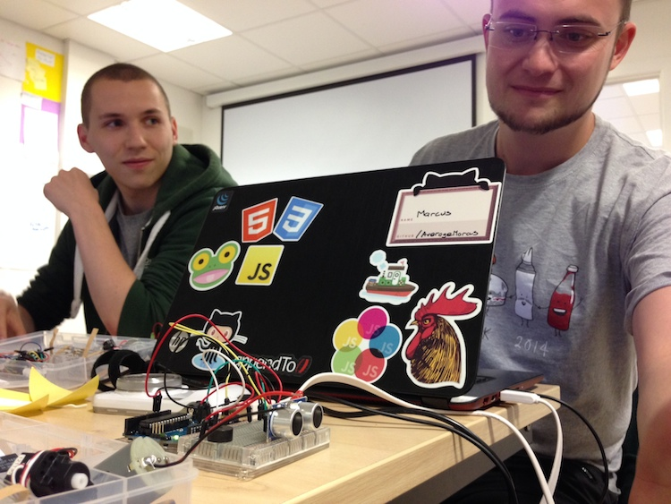
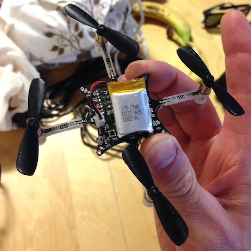
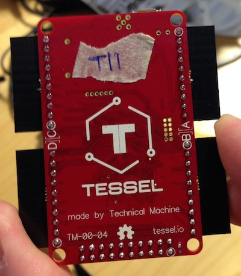
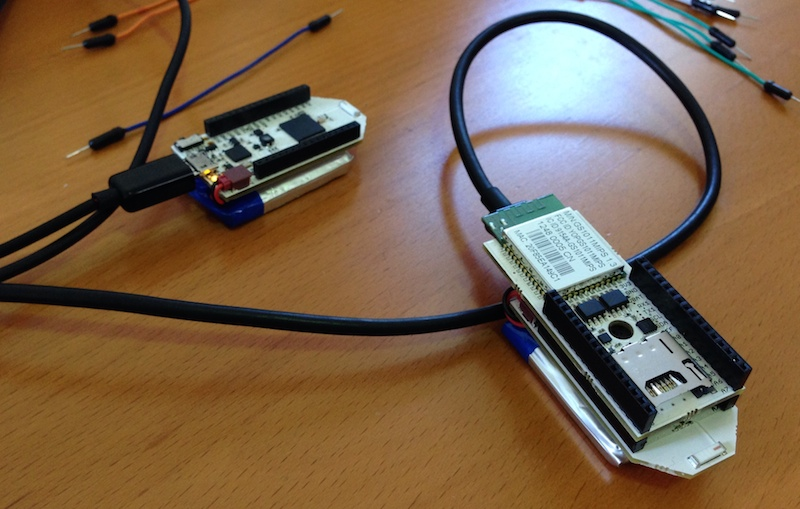
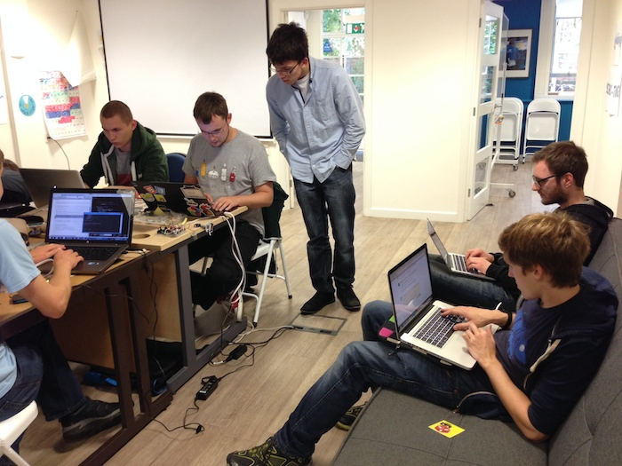

On the 23rd of August we ran the last event in the [JSOxford 2014 Summer of Hacks](http://jsoxford.com/2014/summer-of-hacks/), building JavaScript powered NodeBots. Cue maniacal cackling as we plan to take over the world.

<!-- more -->

A [NodeBot](http://nodebots.io/) is any JavaScript-powered robot, and the aim of the day was to bridge the gap into the physical world with the help of Arduinos, sensors, servos, motors, LEDs and a load of LEGO.

Most importantly, [we had a flag](https://www.youtube.com/watch?v=uEx5G-GOS1k):

[Alan Shaw](https://twitter.com/intent/follow?screen_name=_alanshaw) and [Oli Evans](https://twitter.com/intent/follow?screen_name=olizilla) very kindly came up for the day from London to impart some of their NodeBots wizardry on us and show off their impressive suite of hardware. It was great to start the day with the message that 'hardware is really hard' – as I repeatedly drove our JS remote control car into the wall I was definitely feeling that!

We purchased 10 [oomlout starter kits](http://oomlout.co.uk/) and had a few servos, Arduino Uno boards and a load of wires kicking around, so there was plenty of kit and the day started with most people running through the introductory blinking LED lessons. Some chose to start with Arduino and some went straight to using the Johnny Five library, a JS library for controlling the Arduino inputs/outputs over the USB cable. 

Once the initial single-LED board was out the way things got a bit more interesting, and the rest of the day saw some cool little projects at varying levels of completeness (sorry if I forgot yours):

* A parking sensor which evolved into an [octocat alert](http://instagram.com/p/sC_S_npxm-) with lights, beeping an waving octocats.
* A RESTful web-based temperature sensor.
* A temperature-sensing board with LCD display.
* A device built with Scratch for Arduino.
* 2-bit Guitar Hero. I still have that Sweet Child O' Mine riff replaying in my head.
* An RC car with automatic braking to avoid obstacles (or not, it turned out)

We deliberately didn't set a particular objective so everyone could plough on at their own pace and dive into whatever grabbed their interest. This worked really well, and had the added advantage that it was really easy to organise!

After Oli and Alan had got us all excited about the possibilities they set about linking a Logitech gaming joypad with the CrazyFlie, a cool but twitchy little quadcopter with a death-wish. These little devices are quite exciting (there's nothing boring about flying) but can pick up a lot of speed and cause a lot of damage to themselves with a bit of errant programming. 

Needless to say it didn't take long before the inevitable:

<blockquote class="twitter-tweet" lang="en">
...annnnd the <a href="https://twitter.com/hashtag/crazyflie?src=hash">#crazyflie</a> is broken :( <a href="https://twitter.com/JSOxford">@JSOxford</a> <a href="https://twitter.com/hashtag/nodebots?src=hash">#nodebots</a>
&mdash; Alan Shaw (@_alanshaw) <a href="https://twitter.com/_alanshaw/statuses/503178382201618433">August 23, 2014</a></blockquote>

Fortunately there was plenty of other kit to get overly enthusiastic about. 

One limitation of johnny-five is that you need a connection to a laptop to run the JavaScript, so roving machines or fighting bots can be a problem. The [Espruino](http://www.espruino.com/) and [Tessel](https://tessel.io/) boards look really promising because they take different approaches to enabling developers to write JS and end up with a standalone board.

### Pinoccio and the Dension WiRC

[Chris](https://twitter.com/intent/follow?screen_name=paradigm_tee) and I wanted to hack on the JSOxford RC cars, a trio of [Dension WiRC](http://www.dension.com/product/wirc-wifi-rc-receiver) cars which can be controlled using JavaScript over WiFi and have a webcam onboard. The is a [node library](https://github.com/jsoxford/node-wirc) from a previous hack-day to communicate with the car.

Our first thought was to add more sensors to the existing car but that didn't seem possible so we settled on the idea of using a Pinoccio board as a sensor array and then have a single JS script running on the laptop which would use these sensor readings to action the car. The Pinoccio board seemed perfect for this because the 'lead scout' board has a WiFi backpack. Now that I've had a couple of days to look into Pinoccio in a bit more detail it's clear that all the limitations I'm about to talk about were because of our lack of understanding. Hopefully we'll run another NodeBots day and get a chance to play with it again.

[Pinoccio boards](https://pinocc.io/) are a great idea: mesh-networked Arduino-based devices which connect to the Internet by default, combined with a web-based IDE. The result is a system you can get up and running with in minutes. Needless to say, having feedback on the IR rangefinder's value in the IDE without typing a single line of code got us quite excited.

I'd thoroughly recommend having a closer look at the Pinoccio boards. I am particular taken by the way it has battery (including charging), wireless networking, and more importantly a way to access the device from a computer without needing to plug in. The boards also have a temperature sensor which is a nice addition for the home automation projects I'm thinking about.

Unfortunately our enthusiasm was stifled when we tried to use the [node client library](https://github.com/Pinoccio/client-node-pinoccio/). While it's suitable for non-realtime applications, the library connects to hq.pinocc.io rather than to the device, which leads to >1s latency for reads. The [pinoccio-server](https://www.npmjs.org/package/pinoccio-server) package allows you to run your own HQ, and I'd guess that while flashing the devices with the updated server address you'd also be able to update the refresh rate (obviously at the expense of battery life).

Using [ScoutScript commands](http://support.pinocc.io/hc/en-us/articles/200250539-ScoutScript-Overview#functions) it's possible to write functions and save them on the device, which is great if a scout on the mesh needs to carry out an action when another scout on the network detects an input. We didn't find this section of the docs until after the event. Sad face.

So at the moment I'm not sure how you'd go about streaming the live status of an input at a greater resolution than once per second, but I know it's possible because of [this video](http://projectable.me/post/48713397681/scout6050-i-was-asked-to-put-together-a-quick).

It's a shame we only had the afternoon to play around with these devices, and I'll be picking up a pair soon to play with over winter.

### Summary

Thanks to everyone who's helped out with the JSOxford Summer or Hacks and made it possible, and a huge thanks to [Ben](https://twitter.com/intent/follow?screen_name=benjaminbenben) for coming up with the idea in the first place. We also owe [Alan Shaw](https://twitter.com/intent/follow?screen_name=_alanshaw) and [Oli Evans](https://twitter.com/intent/follow?screen_name=olizilla) at least one or two beers for bringing their skills and enthusiasm and giving up a day to escape the big smoke.

I've also got to say a big 'thank you' to the great sponsors who've made it possible to make the events almost free:

* [B2M Solutions](http://www.b2m-solutions.com/)
* [GitHub](https://github.com) 
* [Haybrook IT Resourcing](http://www.haybrook.co.uk/)
* [Treehouse](http://teamtreehouse.com/)
* [White October](http://www.whiteoctober.co.uk/)

Looking forward to the autumn and winter, we're keen to keep the JavaScript community in Oxford buzzing, so [get in touch with us on Twitter](https://twitter.com/intent/tweet?text=Yo%20@JSOxford!) to let us know:

* What you'd like to talk about or listen to at upcoming meetups.
* Which events you'd like to see come to Oxford, and which events you'd love to see happen again.

I'm not the only one to write up the event:

* [Marcus Noble's blog](https://blog.marcusnoble.co.uk/2014-08-24-nodebots/)
