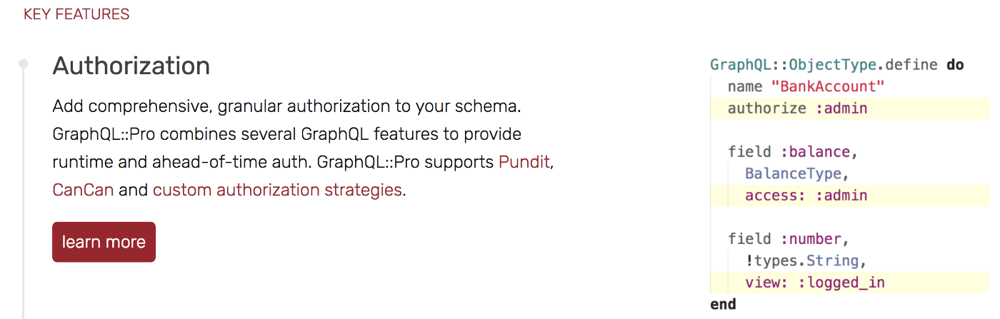
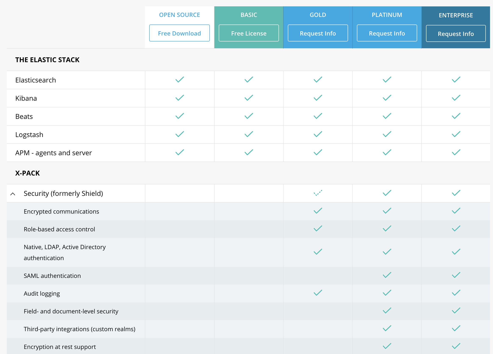

We rely on Open Source for a huge portion of the Internet (and beyond), yet many projects still rely on goodwill and donated effort in order to survive. Sometimes that’s not enough, and organisations like Ruby Together have helped to make critical pieces of developer infrastructure more sustainable. Other projects have taken the approach of introducing premium tiers, adding enhanced functionality to libraries, tools and services in an effort to generate revenue and enable the (sometimes sole) developer to spend more time on the project.

Sustainability in Open Source software development is hugely important, but we need to walk the path carefully.

How do you choose which features to include in the “pro” version of your library or product? Include too few and users may not see the value in upgrading; include too many and you may not see enough adoption of the free tier to funnel into your paid version. But I think feature choice goes further than that.

Developers are starting to adopt [serverless patterns](https://serverless.com/) for side-projects to keep hosting costs down. Message queues and background processing are [built in](http://edgeguides.rubyonrails.org/active_job_basics.html) to modern frameworks. Federated authentication is just a [library](https://github.com/omniauth/omniauth) [away](https://github.com/jaredhanson/passport). The lines between enterprise and personal projects are blurring.

As a community we need to push best practices. Maintainability. Accessibility. Security. Probably not in that order. We have a responsibility to remove barriers to developers using our software so they fall into the [Pit of Success](https://blog.codinghorror.com/falling-into-the-pit-of-success/). If we withhold features from these categories from our free version, we’re making secure, maintainable, accessible software harder to produce, which doesn’t feel like a good thing.

Now, I’m going to pick on the excellent [Ruby GraphQL library](https://github.com/rmosolgo/graphql-ruby) purely because finding it prompted me to write this post and having a concrete example makes it easier to think about. Authoring and maintaining this project is no small feat, and in an effort to make the project sustainable the author has created [GraphQL::Pro](http://graphql.pro/), which adds a number of features to the free library, provides a GraphQL subscriptions stack, and adds prioritised support. The first feature jumps out:

*GraphQL::Pro offers fine-grained authorisation as a paid feature*

It would be unfair to say that the free version *prevented* you from doing authorisation. A few [walkthroughs](https://blog.codeship.com/how-to-implement-a-graphql-api-in-rails/) exist demonstrating authorisation within mutations, and it’s feasible to implement your own authorisation layer in the Open Source gem. But, if this were a free feature would we expect to see better GraphQL implementations in Ruby, with less data potentially exposed to maliciously crafted queries?

Unfortunately this approach isn’t limited to independent library producers. Elastic hides almost all their security features behind a subscription (which [reportedly](https://www.reddit.com/r/elasticsearch/comments/62n2h6/pricing_for_xpack_gold/) costs &gt;$5k USD per node):

*Elastic thinks only Gold customers should have encrypted communications…*

For many organisations, this just means Kibana or ElasticSearch end up behind an nginx proxy or with no security at all. Considering how great Kibana is for visualising data, it’s easy to see how these unsecured applications end up accumulating more sensitive data. If Elastic provided RBAC and encrypted communications as part of their free tier, would we see smaller businesses picking up better security practices?

Elastic’s pricing highlights how the need to generate revenue has eaten into features that should be the right of every citizen of the Internet. Developers should be encouraged and pushed to do better security, for the sake of our users. It’s pretty easy to argue that LDAP, AD & SAML authentication are primarily used by larger organisations who have more ability to pay these license fees, but shouldn’t we be promoting encryption at rest for every use case? Doesn’t *every* Kibana installation deserve encrypted communications?

Frustratingly, while Elastic “opened up” X-Pack [recently](https://www.elastic.co/products/x-pack/open), all the Security features remain “pro”:

<Tweet id="999964355931197440" />

I **absolutely** support efforts to make Open Source projects sustainable. Charging for the use of libraries and services is a completely valid way to generate revenue, and we all need to eat. However, I’m conscious that we may be creating modern crippleware, where the free tier necessitates poor security practices or forces the ones who know better (and have the capital) to upgrade.

---
Thanks to Nevelina Aleksandrova and Emanuil Tolev for help editing this and listening to me rant.